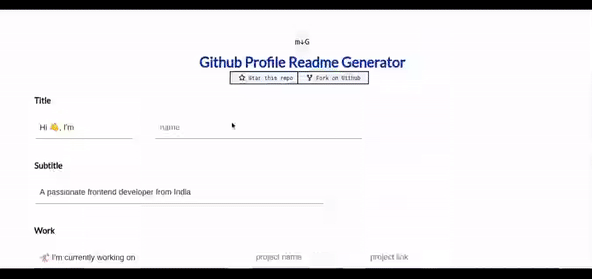

<p align="center">
  <a href="https://krypton-hackathon0/hackathon">
    
  </a>
</p>
<h1 align="center">
  GitHub Profile README Generator
</h1>

<p align="center">
<a href="https://github.com/krypton-hackathon0/hackathon/blob/master/LICENSE" target="blank">

</a>
<a href="https://github.com/krypton-hackathon0/hackathon/fork" target="blank">

</a>
<a href="https://github.com/krypton-hackathon0/hackathon/stargazers" target="blank">

</a>
<a href="https://github.com/krypton-hackathon0/hackathon/issues" target="blank">

</a>
<a href="https://github.com/krypton-hackathon0/hackathon/pulls" target="blank">

</a>
<a href="https://discord.gg/HHMs7Eg" target="blank">

</a>
</p>

<p align="center"></p>

<p align="center">
    <a href="https://readme-generator.ga" target="blank">View Demo</a>
    ·
    <a href="https://github.com/krypton-hackathon0/hackathon/issues/new/choose">Report Bug</a>
    ·
    <a href="https://github.com/krypton-hackathon0/hackathon/issues/new/choose">Request Feature</a>
</p>

<p align="center">
<i>Loved the tool? Please consider <a href="https://paypal.me/radondev">donating</a>  💸 to help it improve!</i>
</p>

<p align="center">
<a href="https://www.paypal.me/radondev">
</a>
<a href='https://ko-fi.com/A
' target='_blank'>
</a>
<a href="https://www.buymeacoffee.com/" target="_blank">
</p>

#### Tired of editing GitHub Profile README with new features?

This tool provides an easy way to create a GitHub profile readme with the latest add-ons such as `visitors count`, `github stats`, etc.

## 🚀 Demo

<a href="https://readme-generator.ga" target="blank">

</a>

Try the tool: [GitHub Profile README Generator](https://readme-generator.ga)

## 🧐 Features

Just fill in the details such as `Name`, `Tagline`, `Dev Platforms Username`, `Current Work`, `Portfolio`, `Blog`, etc. with a minimal UI.

- **Uniform Dev Icons**

- **Uniform Social Icons**

- **Visitors Counter Badge**

- **GitHub Profile Stats Card**

- **GitHub Top Skills**

- **GitHub Streak Stats**

- **Dynamic Dev(.)to Blogs** (GitHub Action)

- **Dynamic Medium Blogs** (GitHub Action)

- **Dynamic Personal Blogs from RSS Feed** (GitHub Action)

- **Wakatime Stats** [contribute](https://github.com/krypton-hackathon0/hackathon/issues/115)

- **Buy Me A Coffee button**

Click on `Generate README` to get your README in `markdown`.
You can preview the README too.

## 🛠️ Installation Steps

1. Clone the repository

```bash
git clone https://github.com/krypton-hackathon0/hackathon.git
```

2. Change the working directory

```bash
cd src
```

3. Install dependencies

```bash
npm install
```

4. Run the app

```bash
npm start
```

🌟 You are all set!

## 🍰 Contributing

Please contribute using [GitHub Flow](https://guides.github.com/introduction/flow). Create a branch, add commits, and [open a pull request](https://github.com/krypton-hackathon0/hackathon/compare).

Please read [`CONTRIBUTING`](CONTRIBUTING.md) for details on our [`CODE OF CONDUCT`](CODE_OF_CONDUCT.md), and the process for submitting pull requests to us.

## 💻 Built with

- [Gatsby](https://www.gatsbyjs.com/)
- [Tailwind CSS](https://tailwindcss.com/): for styling
- [GSAP](https://greensock.com/gsap/): for small SVG Animations

## 🙇 Special Thanks

- [Anurag Hazra](https://github.com/anuraghazra) for amazing [github-readme-stats](https://github.com/anuraghazra/github-readme-stats)
- [Anton Komarev](https://github.com/antonkomarev) for super cool [github-profile-views-counter](https://github.com/antonkomarev/github-profile-views-counter)
- [Gautam Krishna R](https://github.com/gautamkrishnar) for the awesome [blog post workflow](https://github.com/gautamkrishnar/blog-post-workflow)
- [Jonah Lawrence](https://github.com/DenverCoder1) for the incredible [github-readme-streak-stats](https://github.com/DenverCoder1/github-readme-streak-stats)
- [Julien Monty](https://github.com/konpa) for super useful [devicon](https://github.com/konpa/devicon)
- [Eliot Sanford](https://github.com/techieeliot) for adding hashnode as a blog input

## 🙏 Support

<p align="left">
<a href="https://www.paypal.me/radondev">
</a>
<a href="https://twitter.com/intent/tweet?text=Wow:&url=https%3A%2F%2Frahuldkjain.github.io%2Fgithub-profile-readme-generator">

</a>
</p>

<p align="left">
  <a href='https://ko-fi.com' target='_blank'>
  </a>
  <a href="https://www.buymeacoffee.com/" target="_blank">
</p>

<hr>
<p align="center">
Developed with ❤️ by Radon Development
</p>
